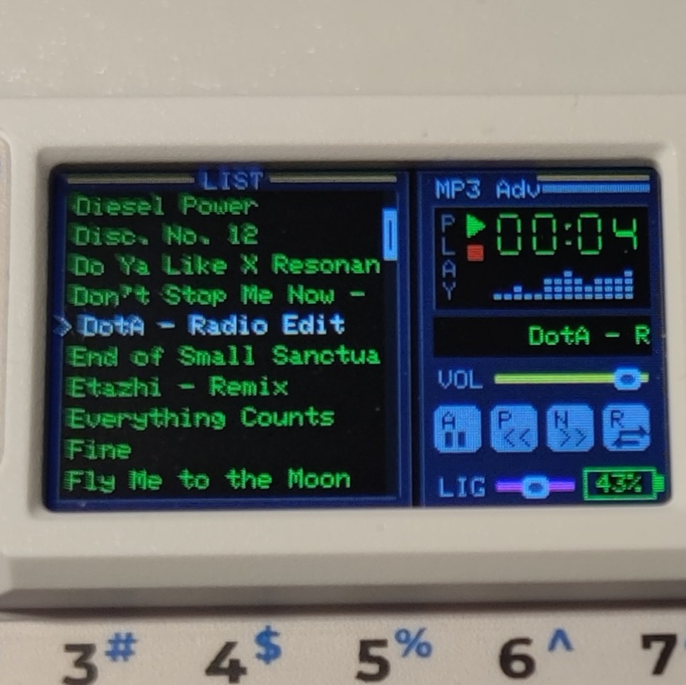

# Mini MP3 Player for Cardputer Adv

This is fork from Moo93egy's repository: [CardPuter_Mp3_Adv](https://github.com/Moo93egy/CardPuter_Mp3_Adv)


<p align="center">
  
</p>

***SD-Card is required***

## Changes:
- Some code improvements
- Optimization
- Folder selection
- Support for previous *M5Stack Cardputer* generations has been removed.

## Installation and Usage

1. Clone the repository to your computer:

   ```bash
   git clone https://github.com/sourcels/Mini-Mp3Player_Cardputer-Adv.git
   ```

2. Open the project as a **PlatformIO Project** in your IDE (e.g., VSCode with PlatformIO extension).

3. Build and upload the project to your Cardputer Adv:

   ```bash
   pio run
   pio run --target upload
   ```

   Alternatively, you can download the precompiled **.bin** file from the GitHub [Releases](https://github.com/sourcels/Mini-Mp3Player_Cardputer-Adv/releases/) page and flash it directly to your device.

4. Once uploaded, launch the game on your Cardputer and enjoy Mini MP3 Player!

## Contributing

If you have ideas for improvements or new words for the dictionary, feel free to submit a Pull Request!

## License

This project is licensed under the Apache 2.0 License.

---